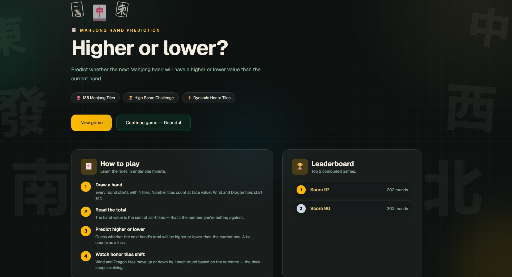
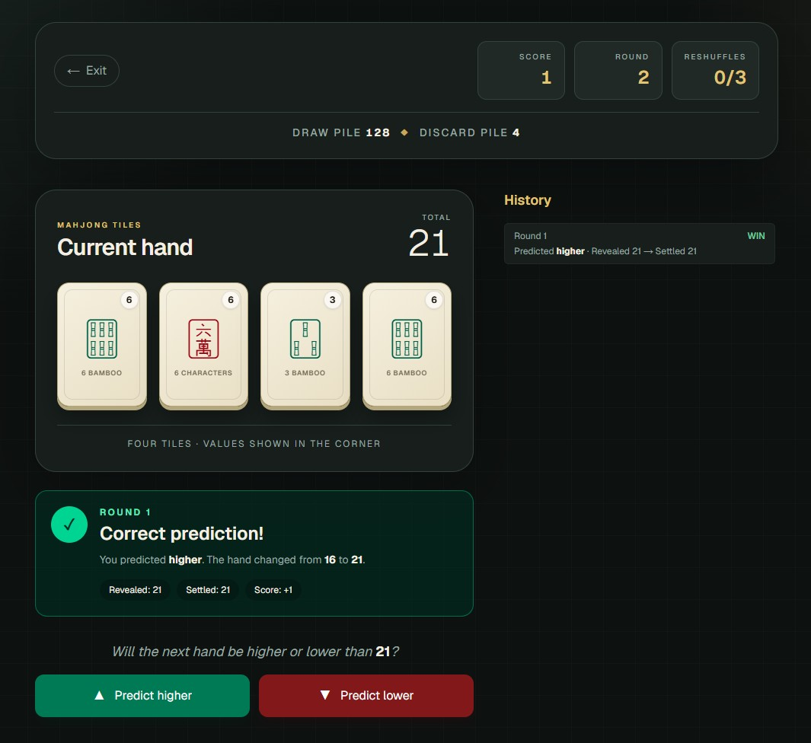
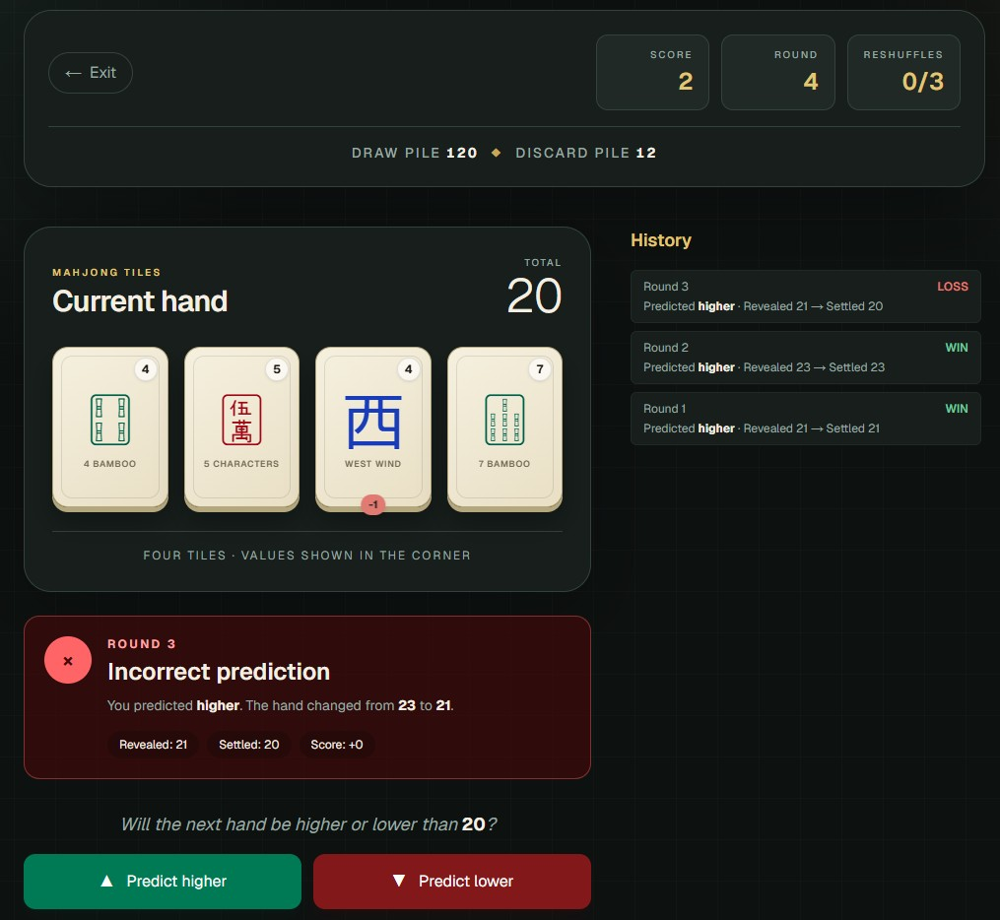
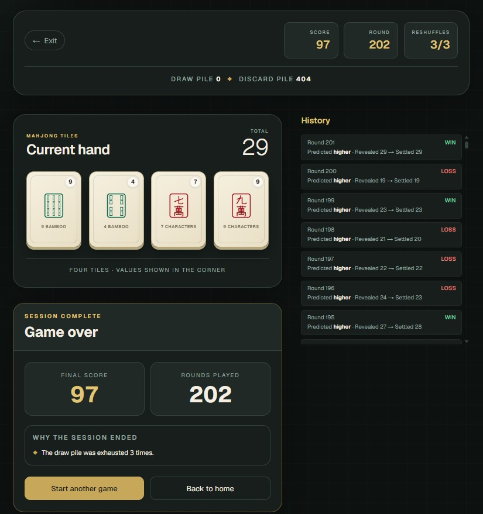
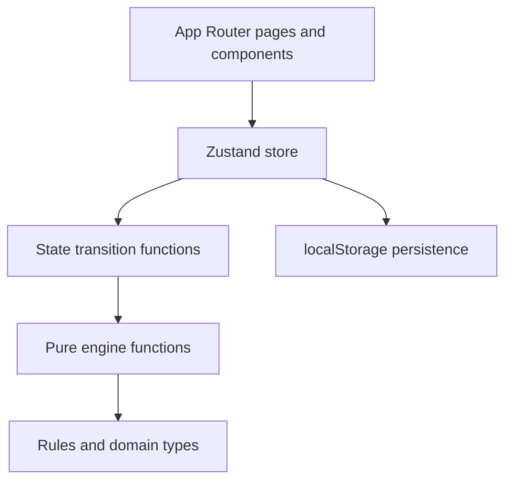
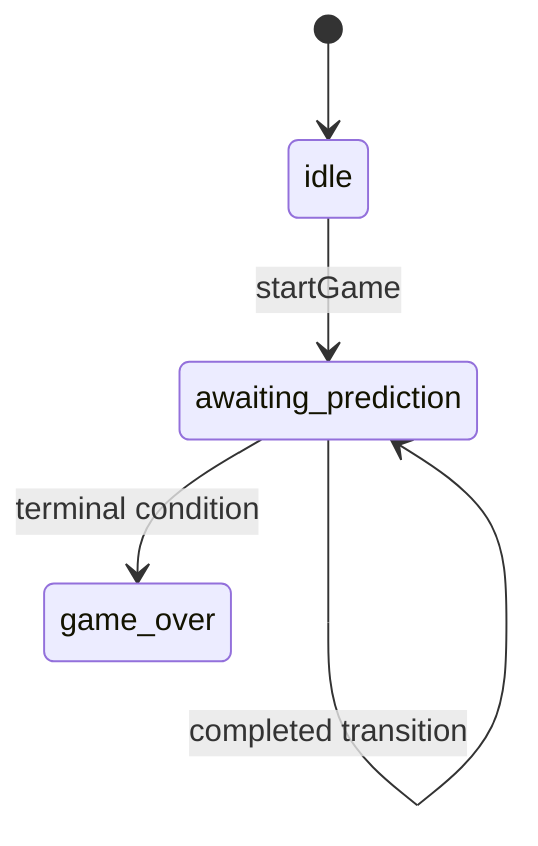

# Mahjong Hand Betting Game

A technical assessment project built with Next.js, React, TypeScript, Zustand, Tailwind CSS, Motion, and Vitest.

The project demonstrates domain modelling, deterministic pure functions, immutable state transitions, persistent client state, reusable UI components, automated tests, and continuous integration.


## Table of contents

- [Repository snapshot](#repository-snapshot)
- [Technical goals](#technical-goals)
- [Technology stack](#technology-stack)
- [Architecture](#architecture)
- [Project structure](#project-structure)
- [Domain model](#domain-model)
- [Rules and assumptions](#rules-and-assumptions)
- [Engine reference](#engine-reference)
- [Application state](#application-state)
- [Store, persistence, and hydration](#store-persistence-and-hydration)
- [Leaderboard](#leaderboard)
- [Pages and UI components](#pages-and-ui-components)
- [Styling, motion, and accessibility](#styling-motion-and-accessibility)
- [Testing](#testing)
- [Continuous integration](#continuous-integration)
- [Available package scripts](#available-package-scripts)
- [Quality verification](#quality-verification)
- [File-by-file reference](#file-by-file-reference)
- [Important implementation decisions](#important-implementation-decisions)
- [Current limitations](#current-limitations)
- [Extension points](#extension-points)
- [Troubleshooting](#troubleshooting)
- [Development approach](#development-approach)
- [AI usage disclosure](#ai-usage-disclosure)

## Repository snapshot
  
  
 
   
- Repository: [Fadelm300/mahjong-hand-betting-game](https://github.com/Fadelm300/mahjong-hand-betting-game)
- Default branch: `main`
- Package version: `0.1.0`
- Current documented commit: `e15f9c9` (`add test dependencies and scripts`)
- Documentation reviewed: 16 July 2026
- Application routes: `/` and `/game`
- Automated unit tests: 12 tests across 4 test files
- Persistence: browser `localStorage`
- CI: GitHub Actions on pushes and pull requests targeting `main`

## Technical goals

The codebase was structured around the assessment's emphasis on scalability and interview-time extension.

The main engineering goals are:

1. Keep domain rules independent from React.
2. Keep the engine deterministic when a random source is injected.
3. Avoid mutating arrays or objects received by engine functions.
4. Keep multi-step state transitions outside UI components.
5. Use TypeScript discriminated unions to model tiles safely.
6. Persist the active session and local results without introducing a backend.
7. Make the visual layer reusable through small components.
8. Validate core deterministic behavior with fast unit tests.
9. Run the same quality checks locally and in CI.

## Technology stack

| Technology | Repository version | Responsibility |
| --- | ---: | --- |
| [Next.js](https://nextjs.org/docs) | `16.2.10` | App Router, pages, metadata, build pipeline, and production output |
| [React](https://react.dev) | `19.2.4` | Client components and UI rendering |
| [TypeScript](https://www.typescriptlang.org/docs/) | `^5` | Domain types, strict compile-time checking, and editor support |
| [Zustand](https://zustand.docs.pmnd.rs/) | `^5.0.14` | Client-side state, actions, subscriptions, and persistence middleware |
| [Tailwind CSS](https://tailwindcss.com/docs) | `^4` | Utility-first component styling |
| [Motion](https://motion.dev/docs/react) | `^12.42.2` | Tile entry, hover, and value-change animations |
| `framer-motion` | `^12.42.2` | Installed dependency; the current source imports from `motion/react` |
| [Vitest](https://vitest.dev/) | `^4.1.10` | Unit test runner and assertions |
| [ESLint](https://eslint.org/docs/latest/) | `^9` | Static analysis using Next.js and TypeScript rules |
| [GitHub Actions](https://docs.github.com/actions) | workflow configuration | Automated test, lint, type-check, and build checks |
| Node.js | `22` in CI | JavaScript runtime used by the automated pipeline |
| npm | lockfile-based | Dependency installation and script execution |

## Architecture

The project follows a one-way dependency direction:



The important rule is that lower layers do not import higher layers:

- `config` and `types` know nothing about React, Zustand, or pages.
- `engine` depends only on rules, types, and other engine utilities.
- `state` combines engine functions into complete state transitions.
- `store` exposes state transitions as actions and adds persistence.
- `components` render data received through props.
- `pages` select data from the store, compose components, and handle navigation.

This separation makes engine behavior testable without rendering React components.

## Project structure

```text
.
├── .github/
│   └── workflows/
│       └── ci.yml
├── src/
│   ├── app/
│   │   ├── game/
│   │   │   └── page.tsx
│   │   ├── globals.css
│   │   ├── layout.tsx
│   │   └── page.tsx
│   └── features/
│       └── game/
│           ├── components/
│           │   ├── game-stats.tsx
│           │   ├── hand-display.tsx
│           │   ├── history-panel.tsx
│           │   └── tile-card.tsx
│           ├── config/
│           │   └── game-rules.ts
│           ├── engine/
│           │   ├── add-hand-to-discard-pile.ts
│           │   ├── adjust-honor-values.ts
│           │   ├── calculate-hand-value.test.ts
│           │   ├── calculate-hand-value.ts
│           │   ├── create-deck.test.ts
│           │   ├── create-deck.ts
│           │   ├── draw-hand.test.ts
│           │   ├── draw-hand.ts
│           │   ├── find-game-over-reasons.ts
│           │   ├── replenish-draw-pile.ts
│           │   ├── resolve-prediction.ts
│           │   ├── resolve-round.ts
│           │   ├── shuffle-tiles.test.ts
│           │   └── shuffle-tiles.ts
│           ├── hooks/
│           │   └── use-game-hydration.ts
│           ├── leaderboard/
│           │   └── rank-leaderboard.ts
│           ├── state/
│           │   ├── game-state.ts
│           │   ├── play-round.ts
│           │   └── start-new-game.ts
│           ├── store/
│           │   └── game-store.ts
│           └── types/
│               └── game.ts
├── .gitignore
├── eslint.config.mjs
├── next.config.ts
├── package-lock.json
├── package.json
├── postcss.config.mjs
├── README.md
└── tsconfig.json
```


## Domain model

Domain types live in [`src/features/game/types/game.ts`](src/features/game/types/game.ts).

### Tile categories

The domain uses a discriminated union named `Tile`:

```ts
type Tile = NumberTile | WindTile | DragonTile;
```

Every tile shares these properties through the internal `BaseTile` interface:

| Property | Type | Meaning |
| --- | --- | --- |
| `id` | `string` | Stable identity used by React keys, history, and value-change tracking |
| `category` | `"number" \| "wind" \| "dragon"` | Discriminator used for type narrowing |
| `value` | `number` | Current value used by hand calculations |

### Number tiles

`NumberTile` adds:

- `suit`: `characters`, `bamboo`, or `dots`
- `rank`: an integer union from 1 through 9
- `valueGroup: null`: number tiles do not participate in dynamic honor value grouping

### Wind tiles

`WindTile` adds:

- `kind`: `east`, `south`, `west`, or `north`
- `valueGroup`: an identity or logical group key for dynamic value behavior

### Dragon tiles

`DragonTile` adds:

- `kind`: `red`, `green`, or `white`
- `valueGroup`: an identity or logical group key for dynamic value behavior

### Hand

```ts
type Hand = readonly Tile[];
```

The readonly array communicates that functions should derive new arrays instead of mutating a received hand.

## Rules and assumptions

All central values live in [`src/features/game/config/game-rules.ts`](src/features/game/config/game-rules.ts).

The file separates two concepts:

- `RULES_FROM_ASSESSMENT`: values taken directly from the assessment.
- `GAME_ASSUMPTIONS`: implementation decisions made where the assessment leaves room for interpretation.

### Assessment rules

| Rule | Current value |
| --- | ---: |
| Number tile value | Face/rank value |
| Initial wind and dragon value | `5` |
| Honor value change | `1` |
| Minimum terminal tile value | `0` |
| Maximum terminal tile value | `10` |
| Maximum draw-pile exhaustions | `3` |
| Leaderboard size | `5` |

### Implementation assumptions

| Assumption | Current value | Effect |
| --- | --- | --- |
| Hand size | `4` | `drawHand` draws four tiles by default |
| Correct result score | `1` | Added to the score for a correct result |
| Incorrect result score | `0` | No score is added for an incorrect result |
| Tie outcome | `loss` | Equal values currently resolve using the configured loss rule |
| Honor value scope | `tile-instance` | Each physical honor tile owns its own dynamic value identity |
| Next baseline | Adjusted value | The post-adjustment hand total becomes the next comparison value |
| Third exhaustion timing | `after-round` | Stored as an explicit assumption for rule clarity |
| Copies per tile | `4` | Four copies are created for every logical Mahjong tile |

### Deck composition

| Category | Calculation | Count |
| --- | ---: | ---: |
| Number tiles | 3 suits × 9 ranks × 4 copies | 108 |
| Wind tiles | 4 winds × 4 copies | 16 |
| Dragon tiles | 3 dragons × 4 copies | 12 |
| **Total** | 108 + 16 + 12 | **136** |

## Engine reference

The engine is a set of small functions in `src/features/game/engine`. These functions do not import React or Zustand.

### `create-deck.ts`

Exports:

```ts
createDeck(deckSequence = 1): Tile[]
```

Responsibilities:

- Validates that `deckSequence` is a positive integer.
- Creates all 136 tile objects.
- Assigns number values from their rank.
- Assigns the configured initial value to winds and dragons.
- Creates IDs containing the deck sequence, category, logical tile, and copy number.
- Uses `valueGroup` to preserve the chosen honor-value scope.

The deck sequence prevents ID collisions when a fresh deck is introduced later.

Example ID shapes:

```text
deck-1:number:bamboo:3:2
deck-1:wind:east:1
deck-2:dragon:red:4
```

### `shuffle-tiles.ts`

Exports:

```ts
shuffleTiles<T>(tiles, random = Math.random): T[]
```

Responsibilities:

- Implements the Fisher-Yates shuffle.
- Copies the input before shuffling, preserving immutability.
- Is generic, so it can shuffle any array type rather than only `Tile[]`.
- Accepts a `RandomSource` function for deterministic tests.

### `draw-hand.ts`

Exports:

```ts
drawHand(drawPile, handSize = 4): DrawHandResult
```

`DrawHandResult` contains:

- `hand`: the first `handSize` tiles.
- `remainingDrawPile`: every tile after the hand.

The function rejects non-positive or non-integer hand sizes and rejects a draw pile that cannot produce a complete hand. It uses `slice`, so the original draw pile is unchanged.

### `calculate-hand-value.ts`

Exports:

```ts
calculateHandValue(hand): number
```

The implementation uses `reduce` to add every `tile.value`, starting from zero. An empty hand therefore returns zero.

### `resolve-prediction.ts`

Defines the internal comparison and result vocabulary:

- `PredictionDirection`: `higher` or `lower`
- `HandComparison`: `higher`, `lower`, or `equal`
- `PredictionOutcome`: `win`, `loss`, or `push`
- `PredictionResolution`: direction, comparison, outcome, and score delta

`resolvePrediction` compares two totals, applies the configured tie policy, and returns a structured result. It does not update global state.

### `adjust-honor-values.ts`

Exports:

```ts
adjustHonorValues(hand, outcome): AdjustHonorValuesResult
```

Responsibilities:

- Leaves number tiles unchanged.
- Leaves the hand unchanged for a `push`.
- Derives updated wind and dragon objects for non-push outcomes.
- Records each changed tile's ID, previous value, and next value.
- Returns both the adjusted hand and the value-change metadata required by the UI.

The function does not clamp at 0 or 10. The terminal value is preserved and then detected by the game-over check.

### `add-hand-to-discard-pile.ts`

Exports:

```ts
addHandToDiscardPile(discardPile, hand): Tile[]
```

It returns a new array containing the existing discard pile followed by the hand. Neither input array is mutated.

### `replenish-draw-pile.ts`

Exports:

```ts
replenishDrawPile(
  discardPile,
  exhaustionCount,
  nextDeckSequence,
  random = Math.random,
): ReplenishDrawPileResult
```

Responsibilities:

- Validates the exhaustion count and next deck sequence.
- Increments exhaustion count without exceeding the configured maximum.
- Creates a fresh uniquely numbered deck when replenishment is allowed.
- Combines that deck with discarded tiles.
- Shuffles the combined collection with an injectable random source.
- Clears the discard pile after successful replenishment.
- Returns flags describing whether replenishment occurred or the limit was reached.

At the configured exhaustion limit, it does not create another deck and reports `reachedExhaustionLimit: true`.

### `find-game-over-reasons.ts`

Exports:

```ts
findGameOverReasons(hand, exhaustionCount): GameOverReason[]
```

The returned discriminated union can contain:

- `tile-value-minimum`
- `tile-value-maximum`
- `draw-pile-exhausted`

Number tiles are skipped because their values are fixed between 1 and 9. Returning an array allows multiple terminal reasons to be reported for the same transition.

### `resolve-round.ts`

`resolveRound` is the engine-level orchestrator. It combines existing pure functions and returns a `RoundResolution` containing:

- Original current-hand total
- Newly revealed total
- Settled total after dynamic changes
- Total used as the next comparison baseline
- Structured prediction result
- Settled hand
- Individual honor tile value changes

The file deliberately delegates calculations and rule decisions to smaller functions rather than duplicating them.

## Application state

State definitions live in [`src/features/game/state/game-state.ts`](src/features/game/state/game-state.ts).

### Status lifecycle



`resolving-round` is included in the `GameStatus` union but the current synchronous implementation does not set it. It is an extension point for delayed transitions or UI animation phases.

### `GameState` fields

| Field | Meaning |
| --- | --- |
| `status` | Current lifecycle state |
| `score` | Accumulated score |
| `round` | Current round number |
| `currentHand` | Current readonly tile collection |
| `currentHandValue` | Current comparison value, or `null` before initialization |
| `drawPile` | Remaining draw-pile tiles |
| `discardPile` | Previously discarded tiles |
| `exhaustionCount` | Number of draw-pile exhaustions |
| `nextDeckSequence` | Sequence number reserved for the next fresh deck |
| `history` | Ordered round-resolution records |
| `gameOverReasons` | Structured terminal reasons |

### `start-new-game.ts`

`startNewGame` is a state factory. It creates and shuffles deck 1, draws the initial hand, calculates its value, initializes counters and arrays, and reserves sequence 2 for the next generated deck.

Like the shuffle and replenishment functions, it accepts an injectable random source for deterministic testing.

### `play-round.ts`

`playRound` is the application-state orchestrator. Its responsibility is to convert one valid `GameState` into the next `GameState` while delegating calculations to the engine.

It:

- Rejects transitions from statuses that are not waiting for input.
- Replenishes an empty draw pile when allowed.
- Returns a terminal state when the exhaustion limit is reached.
- Requests the next complete hand from `drawHand`.
- Requests a structured resolution from `resolveRound`.
- Moves the previous current hand into the discard pile.
- Checks terminal reasons after value settlement.
- Produces a new state object with updated counters, piles, history, and values.

The original state object and its arrays are not mutated.

## Store, persistence, and hydration

The Zustand store lives in [`src/features/game/store/game-store.ts`](src/features/game/store/game-store.ts).

### Store shape

`GameStore` combines three concerns:

1. `GameState`: serializable session data.
2. `GameActions`: functions exposed to client components.
3. `LeaderboardState`: locally persisted completed results.

### Store actions

| Action | Responsibility |
| --- | --- |
| `setHasHydrated(value)` | Updates the client hydration flag |
| `startGame()` | Merges the result of `startNewGame()` into the store |
| `makePrediction(direction)` | Uses `playRound()` and records a leaderboard entry when a session transitions to `game-over` |
| `resetGame()` | Merges `initialGameState` into the current store |

Zustand object updates merge by default. Therefore `startGame()` and `resetGame()` update the game fields without deleting store-only fields such as the leaderboard and action functions.

### Persistence

The store uses Zustand's `persist` middleware with:

```text
storage key: mahjong-active-session
storage engine: localStorage
skipHydration: true
```

This keeps the active state and local leaderboard in the same browser profile. There is no server database, account system, or cross-device synchronization.

### Manual hydration

[`use-game-hydration.ts`](src/features/game/hooks/use-game-hydration.ts) handles client restoration.

It:

1. Reads `hasHydrated` from the store.
2. Checks whether Zustand has already completed hydration.
3. Calls `persist.rehydrate()` when required.
4. Sets the flag in a `finally` block, including when restoration fails.
5. Returns a boolean that pages use to avoid rendering saved browser state too early.

This exists because the app uses `skipHydration: true` to control when browser-only storage is read.

## Leaderboard

Leaderboard logic lives in [`src/features/game/leaderboard/rank-leaderboard.ts`](src/features/game/leaderboard/rank-leaderboard.ts).

Each `LeaderboardEntry` contains:

- `id`: generated with `crypto.randomUUID()` in the browser
- `score`
- `rounds`
- `completedAt`: ISO timestamp

`rankLeaderboard`:

1. Removes an existing entry with the same ID.
2. Adds the new entry.
3. Sorts by score in descending order.
4. Uses completion timestamp descending as the tie-breaker.
5. Keeps only the configured top five entries.

The leaderboard is local to one browser storage profile.

## Pages and UI components

### `src/app/page.tsx`

The landing page is a client component because it uses the router, the Zustand hook, and browser-restored state.

Its responsibilities are:

- Wait for persisted-state hydration.
- Read status, score, round, and leaderboard entries.
- Route to `/game`.
- Render new-session and continuation entry points according to state.
- Render the most recently completed score summary.
- Render the local top-five list.

### `src/app/game/page.tsx`

The game route is a client component that composes the smaller presentation components.

Its responsibilities are:

- Wait for hydration.
- Select only the store fields needed by the page.
- Render an idle fallback when no session exists.
- Pass statistics into `GameStats`.
- Pass current hand data and recent value changes into `HandDisplay`.
- Pass history records into `HistoryPanel`.
- Render terminal reasons and navigation.
- Connect page controls to existing store actions.

The page does not implement deck creation, scoring, value adjustment, or terminal-condition logic.

### `game-stats.tsx`

`GameStats` renders:

- Exit navigation callback
- Score
- Round
- Exhaustion count against the configured limit
- Draw-pile count
- Discard-pile count

`StatBlock` is an internal reusable component for label/value pairs. Numeric values use tabular figures to reduce layout movement.

### `hand-display.tsx`

`HandDisplay` receives the hand, hand total, and optional recent honor value changes.

It:

- Renders the total separately from tile details.
- Maps the hand to four `TileCard` components.
- Finds value-change metadata by stable tile ID.
- Uses `AnimatePresence` so entering and leaving tile elements can animate.
- Keeps tile display logic out of the page.

### `tile-card.tsx`

`TileCard` converts a domain `Tile` into visual information.

Presentation mappings include:

- Unicode Mahjong glyph arrays for all number suits and ranks.
- Chinese glyphs for winds and dragons.
- English accessible labels.
- Suit/category-specific ink colors.
- A corner value badge.
- A temporary delta badge when an honor value changes.

Motion behavior includes an initial Y-axis reveal, staggered delay based on tile index, and a small hover lift. The component includes `role="img"` and an `aria-label` containing the tile label and current value.

### `history-panel.tsx`

`HistoryPanel`:

- Copies and reverses history so the newest entry appears first.
- Does not mutate the original readonly history array.
- Displays an empty state when no entries exist.
- Displays round number, result, direction, revealed value, and settled value.
- Uses semantic color variables for win, loss, and push results.
- Limits height and enables vertical scrolling for long histories.

The current component renders textual history summaries; it does not yet render the smaller previous-hand tile visuals requested by the assessment.

## Styling, motion, and accessibility

Global styling lives in [`src/app/globals.css`](src/app/globals.css).

### Design tokens

CSS custom properties define:

- Background and surface colors
- Foreground and muted text colors
- Accent colors
- Mahjong tile surface, edge, ink, and muted-label colors
- Semantic win and loss colors

Components reference tokens rather than repeating raw color values, making theme changes centralized.

### Global behavior

The stylesheet provides:

- Universal `border-box` sizing
- Dark color scheme
- Layered radial and grid backgrounds
- Geist-based font stack
- Visible keyboard focus outlines
- Selection colors
- Thin themed scrollbars
- A reduced-motion media query

### Font and metadata

[`src/app/layout.tsx`](src/app/layout.tsx):

- Loads Geist through `next/font/google`.
- Exposes it as `--font-geist`.
- Applies antialiasing to the body.
- Defines default and templated page titles.
- Defines the application description.

### Accessibility already present

- Semantic buttons use `type="button"`.
- Focus-visible outlines are defined globally.
- Tile cards expose accessible labels.
- Decorative glyphs use `aria-hidden` where appropriate.
- Disabled actions communicate state through the native `disabled` attribute.
- Reduced-motion CSS is present.

### Accessibility work still available

- Add live-region announcements for round and terminal updates.
- Verify contrast across all semantic colors.
- Test full keyboard flow.
- Add component tests using accessibility queries.
- Connect Motion animations to Motion's reduced-motion preference, because JavaScript-driven transforms are not fully controlled by CSS alone.

## Testing

The repository uses Vitest. Current tests are colocated with the pure engine files they verify.

### Current suite

| Test file | Cases | Coverage intent |
| --- | ---: | --- |
| `create-deck.test.ts` | 4 | Total size, unique IDs, category counts, and initial values |
| `shuffle-tiles.test.ts` | 3 | Immutability, element preservation, and deterministic random injection |
| `draw-hand.test.ts` | 3 | Default hand size, original-pile immutability, and incomplete-hand rejection |
| `calculate-hand-value.test.ts` | 2 | Value summation and empty-hand behavior |
| **Total** | **12** | Four deterministic engine units |

### Why random injection matters

`shuffleTiles`, `startNewGame`, `replenishDrawPile`, and `playRound` accept a `RandomSource` function. Production code defaults to `Math.random`; tests can provide a fixed function so results are repeatable.

This avoids mocking global `Math.random` and makes deterministic scenario tests easier to add.

### Important missing tests

The following behavior is implemented but not currently covered by committed tests:

- `resolvePrediction`
- `adjustHonorValues`
- `addHandToDiscardPile`
- `replenishDrawPile`
- `findGameOverReasons`
- `resolveRound`
- `startNewGame`
- `playRound`
- `rankLeaderboard`
- Zustand actions and persistence
- Hydration hook behavior
- React component behavior
- Route-level integration
- End-to-end browser flow

The highest-value next tests are the dynamic honor boundaries, third-exhaustion behavior, tie handling, leaderboard tie-breaking, and complete state transitions.

## Continuous integration

The workflow is defined in [`.github/workflows/ci.yml`](.github/workflows/ci.yml).

### Triggers

- Pushes to `main`
- Pull requests targeting `main`

### Pipeline

The `quality` job runs on `ubuntu-latest` with Node.js 22 and performs:

1. Repository checkout using `actions/checkout@v6`.
2. Node setup and npm cache using `actions/setup-node@v6`.
3. Reproducible dependency installation with `npm ci`.
4. Unit tests.
5. ESLint checks.
6. TypeScript checks without emitting files.
7. Production build.

### CI safeguards

- Workflow permissions are read-only for repository contents.
- Concurrency is grouped by Git ref.
- An older in-progress run is cancelled when a newer run starts for the same ref.
- The lockfile is committed, enabling reproducible `npm ci` installs.

## Available package scripts

| Script | Underlying command | Purpose |
| --- | --- | --- |
| `dev` | `next dev` | Starts the Next.js development environment |
| `build` | `next build` | Produces and validates an optimized production build |
| `start` | `next start` | Serves an existing production build |
| `lint` | `eslint` | Runs static analysis |
| `typecheck` | `tsc --noEmit` | Runs strict TypeScript analysis without generating JavaScript |
| `test` | `vitest run` | Runs the complete test suite once |
| `test:watch` | `vitest` | Re-runs relevant tests while files change |

## Quality verification

The repository's quality gate consists of these commands:

```bash
npm test
npm run lint
npm run typecheck
npm run build
```

These are the same four verification categories enforced by CI.

The CI reference runtime is Node.js 22. Using the same major Node version locally reduces environment differences.

## File-by-file reference

### Root and configuration

| File | Responsibility |
| --- | --- |
| `README.md` | Architecture, decisions, test coverage, limitations, and project disclosure |
| `package.json` | Package metadata, scripts, runtime dependencies, and development dependencies |
| `package-lock.json` | Exact transitive dependency graph used by `npm ci` |
| `tsconfig.json` | Strict TypeScript configuration, bundler resolution, JSX mode, Next plugin, and `@/*` alias |
| `eslint.config.mjs` | Flat ESLint config using Next Core Web Vitals and TypeScript rules |
| `next.config.ts` | Typed Next.js configuration; currently uses default options |
| `postcss.config.mjs` | Registers the Tailwind PostCSS plugin |
| `.gitignore` | Excludes dependencies, build artifacts, environment files, logs, local notes, and generated TypeScript files |
| `.github/workflows/ci.yml` | Defines the automated quality pipeline |

### App Router

| File | Responsibility |
| --- | --- |
| `src/app/layout.tsx` | Root HTML layout, Geist font, global CSS import, and metadata |
| `src/app/globals.css` | Tailwind import, design tokens, global background, focus, selection, scrollbar, and reduced-motion styles |
| `src/app/page.tsx` | Hydrated landing page, local score summary, continuation state, leaderboard, and navigation |
| `src/app/game/page.tsx` | Hydrated game-screen composition and store-to-component wiring |

### Components

| File | Responsibility |
| --- | --- |
| `components/game-stats.tsx` | Exit callback, score, round, exhaustion, and pile-count presentation |
| `components/hand-display.tsx` | Current hand grid, total, recent value-change lookup, and tile composition |
| `components/history-panel.tsx` | Reverse-chronological textual history with bounded scrolling |
| `components/tile-card.tsx` | Domain-to-visual tile mapping, glyphs, accessible labels, values, deltas, and animation |

### Domain and rules

| File | Responsibility |
| --- | --- |
| `config/game-rules.ts` | Central assessment constants and explicit implementation assumptions |
| `types/game.ts` | Tile categories, rank/suit/kind unions, discriminated tile interfaces, and readonly hand type |

### Engine

| File | Responsibility |
| --- | --- |
| `engine/create-deck.ts` | Builds a validated, uniquely identified 136-tile deck |
| `engine/shuffle-tiles.ts` | Generic immutable Fisher-Yates shuffle with random injection |
| `engine/draw-hand.ts` | Validated immutable split into hand and remaining pile |
| `engine/calculate-hand-value.ts` | Sums current tile values |
| `engine/resolve-prediction.ts` | Produces structured comparison, result, and score delta |
| `engine/adjust-honor-values.ts` | Derives adjusted honor tiles and change metadata |
| `engine/add-hand-to-discard-pile.ts` | Immutably appends a hand to discarded tiles |
| `engine/replenish-draw-pile.ts` | Handles exhaustion count, fresh decks, combined shuffle, and limit reporting |
| `engine/find-game-over-reasons.ts` | Detects dynamic value boundaries and exhaustion limit |
| `engine/resolve-round.ts` | Combines calculation, resolution, adjustment, and next-baseline selection |

### Engine tests

| File | Responsibility |
| --- | --- |
| `engine/create-deck.test.ts` | Validates deck size, identity, composition, and starting values |
| `engine/shuffle-tiles.test.ts` | Validates immutability, preservation, and deterministic behavior |
| `engine/draw-hand.test.ts` | Validates split sizes, immutability, and insufficient-pile error |
| `engine/calculate-hand-value.test.ts` | Validates value summation and the empty case |

### State, store, hooks, and leaderboard

| File | Responsibility |
| --- | --- |
| `state/game-state.ts` | Defines lifecycle status, round history entries, and complete serializable state |
| `state/start-new-game.ts` | Creates the initial valid state from engine functions |
| `state/play-round.ts` | Produces the next valid state and coordinates pile/history/terminal updates |
| `store/game-store.ts` | Creates the Zustand store, actions, persistence, and completed-result recording |
| `hooks/use-game-hydration.ts` | Manually restores persisted browser state and exposes hydration readiness |
| `leaderboard/rank-leaderboard.ts` | Deduplicates, ranks, tie-breaks, and truncates local entries |

## Important implementation decisions

### Pure functions before UI

Core rules were implemented as framework-independent functions before being connected to Zustand or React. This reduces the number of dependencies required by tests.

### Immutability

Arrays are copied with spread syntax, `slice`, or `map`. This is important for predictable Zustand updates and avoids accidental changes to previous state or history.

### Dependency injection for randomness

Randomized functions default to `Math.random` but accept a replacement function. This makes tests deterministic and leaves room for seeded randomness later.

### Discriminated unions

Checking `tile.category` safely narrows the tile to `NumberTile`, `WindTile`, or `DragonTile`. This avoids optional-property-heavy models and reduces invalid states.

### Centralized rules

Constants are not scattered across components and transitions. Changing a supported rule begins in `game-rules.ts` and then requires focused tests for affected behavior.

### Structured results

Engine functions return objects such as `DrawHandResult`, `PredictionResolution`, `RoundResolution`, and `ReplenishDrawPileResult`. Callers do not have to infer what happened from side effects.

### Thin store

The store connects state functions to React and persistence. Detailed domain calculations remain in the engine and state layers.

### Stable tile identity

IDs include a deck sequence. This prevents collisions when more than one physical deck generation exists in the same persisted session.

### Local-first persistence

Zustand persistence satisfies active-session continuation and local leaderboard requirements without a backend. The trade-off is that data belongs to one browser storage profile.

## Current limitations

The following items describe the repository as it currently exists; they are not hidden by this documentation.

1. Only four engine units have committed tests. Orchestration, persistence, leaderboard, components, and routes are not covered.
2. The history panel shows textual values rather than smaller previous-hand tile visuals.
3. `resolving-round` exists in the status type but is never assigned by the current synchronous transition.
4. The leaderboard and active session are browser-local and have no account or server synchronization.
5. Persisted state has no explicit schema version, migration function, or validation layer.
6. Round history grows for the duration of a session and is persisted without a separate history limit.
7. Both `motion` and `framer-motion` are installed, while current components import `motion/react`; one dependency may be redundant.
8. Motion components do not yet use Motion's `useReducedMotion` hook.
9. The code contains several long informal explanatory comments that should be edited into concise production comments before final submission.
10. The current tie type supports `loss` and `push`; a comment in the configuration mentions an additional option that is not represented by the type.
11. `next.config.ts` currently contains no custom configuration.
12. There are no component, integration, or end-to-end browser tests.
13. There is no backend, authentication, analytics, or remote error monitoring.
14. The landing page and terminal summary are functionally present but still have room for visual and accessibility refinement.

## Extension points

The architecture intentionally leaves several focused extension paths:

- Add or change rule constants in `game-rules.ts` with matching unit tests.
- Add new tile presentation mappings inside `TileCard` without changing engine functions.
- Add animation phases by using the existing `resolving-round` state.
- Add a seeded random source through the existing random function parameters.
- Replace local persistence behind the store without rewriting the engine.
- Add a persistence `version`, `migrate`, and `partialize` configuration.
- Add strategy functions for alternative comparison, scoring, or tie rules.
- Render `resolution.settledHand` from history as compact tile components.
- Add capped or paginated history independently from the top-five leaderboard rule.
- Add unit tests at the engine boundary and integration tests at the state boundary.
- Add component tests without importing or mocking the complete engine.

## Troubleshooting

### Hydration mismatch containing `mdl-js`

During development, a warning may show an extra `class="mdl-js"` on the browser's `<html>` element even though the application layout renders only `lang="en"`.

Search the tracked source first:

```bash
rg -n --hidden \
  -g '!node_modules/**' \
  -g '!.next/**' \
  'mdl-js|material\.min\.js|componentHandler'
```

If the repository contains no match, compare the raw server HTML with a clean browser profile. Browser extensions can modify the DOM before React hydrates it. Do not add `suppressHydrationWarning` merely to hide an extension-generated mismatch.

### Persisted development state looks unexpected

The Zustand storage key is `mahjong-active-session`. State survives navigation and browser reloads in the same profile. Debugging should distinguish between initial in-memory state and restored persisted state.

### Local explanatory files do not appear in Git

The path `/src/features/game/engine/txt/` is intentionally listed in `.gitignore`. These files are local learning notes and are not part of the repository submission.

## Development approach

The Git history shows an incremental implementation strategy rather than one large commit.

The main phases were:

1. Initialize Next.js and install state/animation dependencies.
2. Establish the application foundation.
3. Define game rules and domain types.
4. Add deck creation, drawing, value calculation, comparison, and shuffling as separate engine commits.
5. Add honor adjustment, round resolution, discard behavior, replenishment, and terminal detection.
6. Define state and state-transition orchestrators.
7. Add the game page and Zustand store.
8. Add resumable browser persistence and the local leaderboard.
9. Add four groups of unit tests.
10. Add continuous integration.
11. Add reusable tile, hand, history, and statistics components.
12. Add explicit test scripts and dependencies.

This history makes it possible to discuss each concern separately during an interview.

## AI usage disclosure

AI was used as a pair-programming and learning assistant during this assessment.

### AI-assisted work

AI assistance was used for:

- Breaking the engine into smaller implementation steps.
- Discussing architecture and separation of concerns.
- Drafting and reviewing portions of engine, state, store, UI, and test code.
- Explaining TypeScript generics, immutable updates, Fisher-Yates shuffling, Zustand persistence, and hydration.
- Suggesting test cases and CI structure.
- Drafting and organizing this README.

### Developer-owned work

The developer remained responsible for:

- Interpreting the assessment and selecting assumptions.
- Creating and maintaining the repository.
- Deciding which suggestions to accept, change, or reject.
- Integrating code into the project.
- Running commands and reviewing diffs.
- Debugging local browser and hydration behavior.
- Executing tests, lint, type-check, and production builds.
- Managing commits and pushes.
- Reviewing the final behavior and being able to explain the submitted code.

AI output was treated as a draft to inspect, not as an authority. The submitted repository remains the developer's responsibility.

---

For implementation details, start with [`game-rules.ts`](src/features/game/config/game-rules.ts), then read [`game.ts`](src/features/game/types/game.ts), the pure [`engine`](src/features/game/engine), the [`state`](src/features/game/state) transitions, the [`store`](src/features/game/store/game-store.ts), and finally the pages and components.